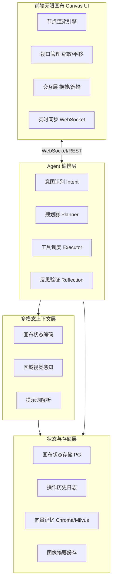
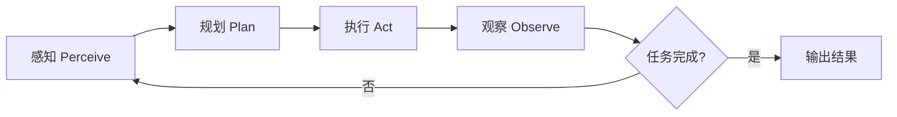
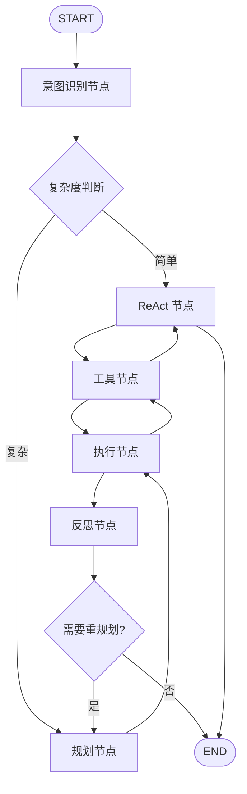
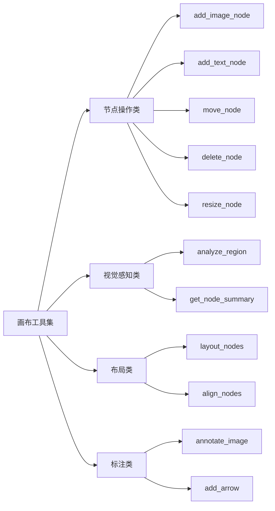
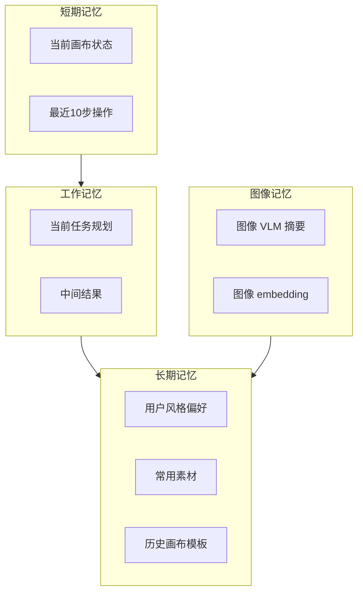
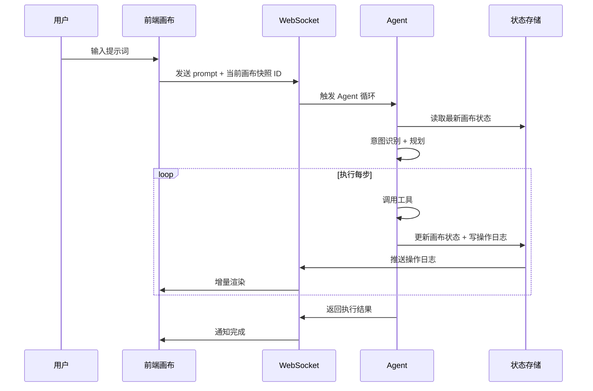

# 无限画布图像智能体 - 架构设计文档

> 版本：v0.1（讨论稿）
> 日期：2026-09-15
> 状态：待评审

---

## 1. 项目概述

### 1.1 项目目标

构建一个以**无限画布**为交互载体、以**图像信息为核心上下文**的智能体系统。用户通过自然语言提示词与画布交互，Agent 能够理解画布当前状态，自主规划并执行画布操作（添加图像、生成图像、布局、标注、删除等）。

### 1.2 核心定位

- 不是普通的文生图工具，而是**画布原生的多模态智能体**
- 上下文 = 画布上的所有图像 + 文本 + 标注 + 用户提示词
- Agent 能"看到"画布，并对画布进行持续的多步操作

### 1.3 与现有产品的差异

| 维度 | 普通文生图 | 图像编辑器 | 本项目 |
|------|-----------|-----------|--------|
| 交互 | 文本提示词 → 单图 | 手动拖拽编辑 | 自然语言 → 画布多步操作 |
| 上下文 | 仅提示词 | 用户视觉判断 | 结构化画布状态 + 视觉感知 |
| 自主性 | 单次生成 | 无 | 规划-执行-反思循环 |

---

## 2. 核心挑战

### 2.1 画布感知问题

无限画布可能包含数十到数百个节点，直接将整张画布截图传给多模态模型存在：
- **Token 爆炸**：高分辨率图像 token 开销极大
- **细节丢失**：缩小后小节点看不清
- **重复计算**：每次推理都要重新"看"整张图

### 2.2 操作可控性

Agent 对画布的操作需要**原子化、可回放、可撤销**，且不能让 Agent 直接操作 DOM，必须通过受控的工具接口。

### 2.3 状态一致性

前端画布状态与后端 Agent 视角下的状态必须保持一致，避免 Agent 基于过期状态做决策。

---

## 3. 整体架构图

### 3.1 分层架构总览



### 3.2 Agent 核心循环



### 3.3 LangGraph 编排图



---

## 4. 分层模块详细设计

### 4.1 前端画布层

**职责**：画布渲染、用户交互、状态同步

| 子模块 | 职责 | 技术选型 |
|--------|------|---------|
| 节点渲染 | 图像/文本/标注节点的绘制 | tldraw / React Flow |
| 视口管理 | 缩放、平移、自适应 | 内置 |
| 交互层 | 拖拽、框选、多选、缩放 | 内置 |
| 实时同步 | 与后端操作日志双向同步 | WebSocket |
| 回放引擎 | 按操作日志回放渲染 | 自研 |

**关键设计**：
- 前端不直接执行 Agent 操作，而是接收后端下发的**操作日志（Operation Log）**，回放渲染
- 保证前后端状态一致性的唯一数据源是后端的画布状态存储

### 4.2 Agent 编排层

**职责**：意图理解、任务规划、工具调度、结果反思

采用 **Plan-and-Execute 为主、ReAct 为辅** 的混合策略：

| 模式 | 适用场景 | 特点 |
|------|---------|------|
| Plan-and-Execute | 复杂多步指令（布局、批量操作） | 先拆解步骤再执行，可预测性强 |
| ReAct | 简单单步操作 + 需要视觉判断 | 边想边做，响应快 |

**核心组件**：

```python
@dataclass
class AgentState:
    canvas_state: CanvasState          # 当前画布结构化状态
    user_prompt: str                   # 用户输入
    intent: Intent | None              # 识别出的意图
    plan: Plan | None                  # 规划出的步骤
    current_step: int                  # 当前执行到第几步
    tool_results: list[ToolResult]     # 已执行工具的结果
    need_visual_check: bool            # 是否需要视觉感知
```

### 4.3 多模态上下文层

**职责**：将画布状态编码为 LLM 可理解的上下文

这是整个架构的**核心模块**，采用 **"结构化元数据 + 按需视觉裁剪"** 混合策略：

#### 画布状态结构化表示

```python
@dataclass
class CanvasState:
    nodes: list[CanvasNode]       # 所有节点元数据
    viewport: Viewport            # 当前视口
    selection: list[str]          # 当前选中节点 ID
    last_operations: list[Op]     # 最近 N 步操作

@dataclass
class CanvasNode:
    id: str
    type: Literal["image", "text", "annotation", "group"]
    position: tuple[float, float]
    size: tuple[float, float]
    content: str                  # 文本内容
    image_summary: str | None     # 预生成的图像描述（关键！）
    tags: list[str]
    z_index: int
```

#### 关键设计：图像摘要缓存

每个图像节点在**上传/生成时**，异步调用多模态模型生成一句话描述并缓存：

```
图像上传 → 异步触发 VLM → 生成 image_summary → 存入缓存
                              ↓
Agent 推理时 → 直接读取 image_summary（无需重复看图）
                              ↓
需要细节时 → 调用 analyze_region 工具裁剪局部区域
```

**收益**：避免每次 Agent 推理都重复消耗大量视觉 token。

### 4.4 状态与存储层

| 存储组件 | 内容 | 技术 |
|---------|------|------|
| 画布状态存储 | 节点数据、图层关系、画布元信息 | PostgreSQL |
| 操作历史日志 | 所有操作的增量日志（用于回放/撤销） | PostgreSQL + Redis 缓存 |
| 图像摘要缓存 | 每个图像节点的 VLM 摘要 | PostgreSQL |
| 向量记忆 | 图像 embedding、用户偏好、历史画布 | Chroma / Milvus |
| 短期记忆 | 当前会话上下文、最近操作 | Redis |

---

## 5. 工具系统设计

工具是 Agent 操作画布的**唯一接口**，必须原子化、有严格 Schema。

### 5.1 工具分类



### 5.2 核心工具定义

```python
# ── 节点操作 ──
@tool
def add_image_node(
    image_source: Literal["upload", "generate", "url"],
    position: tuple[float, float],
    size: tuple[float, float] | None = None,
    prompt: str | None = None,
) -> ToolResult:
    """添加图像节点。image_source=generate 时需提供 prompt"""

@tool
def delete_node(node_id: str) -> ToolResult:
    """删除节点（需用户确认）"""

# ── 视觉感知 ──
@tool
def analyze_region(
    region: tuple[float, float, float, float],  # x, y, w, h
    question: str,
) -> str:
    """裁剪画布指定区域，用多模态模型回答 question"""

@tool
def get_node_image_summary(node_id: str) -> str:
    """获取图像节点的预生成描述"""

# ── 布局 ──
@tool
def layout_nodes(
    node_ids: list[str],
    pattern: Literal["row", "column", "grid"],
    spacing: float = 20.0,
) -> ToolResult:
    """批量布局节点"""

# ── 标注 ──
@tool
def annotate_image(
    node_id: str,
    annotation_type: Literal["bbox", "arrow", "text_label", "blur"],
    annotation_data: dict,
) -> ToolResult:
    """在图像上添加标注"""
```

### 5.3 工具设计原则

1. **单一职责**：每个工具只做一件事
2. **Schema 严格**：用 Pydantic 定义输入输出
3. **结果可验证**：工具返回新状态摘要，供 Agent 反思
4. **安全门控**：删除/覆盖等破坏性操作支持人在回路确认

---

## 6. 记忆系统设计



| 记忆类型 | 存储内容 | 实现方式 | 生命周期 |
|---------|---------|---------|---------|
| 短期记忆 | 画布状态 + 最近操作 | Redis | 会话级 |
| 工作记忆 | 规划步骤 + 中间结果 | LangGraph State | 任务级 |
| 长期记忆 | 用户偏好 + 素材 + 模板 | 向量数据库 | 永久 |
| 图像记忆 | 图像摘要 + embedding | PG + 向量索引 | 永久 |

---

## 7. 数据流设计

### 7.1 正常操作流



### 7.2 状态一致性保证

- 后端是**唯一数据源**（Single Source of Truth）
- 前端只渲染后端下发的操作日志，不自行计算状态
- 每次工具执行后返回**状态版本号**，前端按版本号有序应用

---

## 8. 技术栈选型

| 层 | 选型 | 理由 |
|----|------|------|
| 前端画布 | **tldraw** | 无限画布首选，开源、节点丰富、支持自定义 |
| 前端框架 | React + TypeScript | tldraw 生态，类型安全 |
| 后端框架 | **FastAPI** | 异步、类型安全、自动文档 |
| Agent 编排 | **LangGraph** | 显式状态图、循环/分支/人在回路、可观测 |
| 多模态模型 | GPT-4o / Claude 3.5 Sonnet / Qwen-VL | 视觉理解 + 工具调用 |
| 文生图 | Stable Diffusion / Flux / DALL-E | 根据部署需求选择 |
| 关系数据库 | PostgreSQL | 画布状态、操作日志 |
| 缓存/短期记忆 | Redis | 会话状态、操作缓存 |
| 向量数据库 | Chroma（轻量）/ Milvus（大规模） | 图像 embedding、长期记忆 |
| 实时通信 | WebSocket | 画布操作实时同步 |

---

## 9. 分阶段落地计划

### 阶段一：MVP 画布 + 基础 Agent

**目标**：跑通"提示词 → Agent 操作画布"的最小闭环

- 前端：tldraw 画布基本功能（添加/移动/删除节点）
- 后端：画布状态存储 + 操作日志
- Agent：ReAct 循环 + 3-5 个核心工具（add_image、add_text、move、delete、analyze_region）
- 图像摘要异步生成

### 阶段二：规划能力 + 复杂操作

**目标**：支持复杂多步指令和批量布局

- 接入 Plan-and-Execute 规划模式
- 布局工具（layout_nodes、align）
- 标注工具（bbox、arrow、text_label）
- 操作历史 + 撤销/重做
- 人在回路确认（删除等敏感操作）

### 阶段三：记忆 + 多智能体

**目标**：个性化 + 复杂协作

- 向量记忆系统（用户偏好、素材库）
- 多 Agent 协作（布局 Agent + 标注 Agent + 创意 Agent）
- 可观测性仪表盘（Agent 决策追踪）
- 评估体系（操作成功率、用户满意度）

---

## 10. 待讨论的需求点

以下问题需要在进入开发前明确，会显著影响架构细节：

| 编号 | 问题 | 选项 |
|------|------|------|
| Q1 | 画布类型偏向？ | A. tldraw 式自由画布（涂鸦+便签+图像）<br>B. 节点式画布（React Flow，节点+连线）<br>C. 两者混合 |
| Q2 | 图像主要来源？ | A. 用户上传为主<br>B. Agent 文生图为主<br>C. 两者并重 |
| Q3 | 操作粒度？ | A. 单节点操作为主<br>B. 支持批量/整体布局操作 |
| Q4 | 前端技术栈？ | A. React + TypeScript<br>B. 其他 |
| Q5 | 后端语言偏好？ | A. Python（FastAPI）<br>B. 其他 |
| Q6 | 部署环境？ | A. 本地/私有化<br>B. 云端<br>C. 混合 |
| Q7 | 多模态模型选择？ | A. GPT-4o<br>B. Claude<br>C. 开源 Qwen-VL<br>D. 多模型路由 |
| Q8 | 是否需要多用户/协作？ | A. 单用户<br>B. 多人实时协作 |

---

## 11. 风险与应对

| 风险 | 影响 | 应对策略 |
|------|------|---------|
| 多模态模型延迟高 | Agent 响应慢 | 图像摘要预生成缓存；局部裁剪按需调用 |
| 画布节点过多导致 context 超长 | LLM 推理失败 | 分页/视口裁剪；只传当前视口内节点 + 全局摘要 |
| Agent 误操作破坏画布 | 用户体验差 | 操作日志全量记录 + 一键撤销；敏感操作人在回路 |
| 前后端状态不一致 | 渲染错乱 | 后端唯一数据源 + 版本号有序同步 |
| 工具调用不稳定 | 任务中断 | 工具重试 + 超时熔断 + 部分失败回滚 |

---

## 附录：项目目录结构建议

```
image_agent/
├── frontend/                  # 前端画布
│   ├── src/
│   │   ├── canvas/            # tldraw 封装
│   │   ├── sync/              # WebSocket 同步
│   │   └── components/
│   └── package.json
├── backend/                   # 后端服务
│   ├── app/
│   │   ├── api/               # REST + WebSocket 接口
│   │   ├── agent/             # Agent 编排层
│   │   │   ├── graph.py       # LangGraph 图定义
│   │   │   ├── planner.py     # 规划器
│   │   │   ├── intent.py      # 意图识别
│   │   │   └── reflection.py  # 反思验证
│   │   ├── tools/             # 画布工具集
│   │   │   ├── node_ops.py
│   │   │   ├── vision.py
│   │   │   ├── layout.py
│   │   │   └── annotation.py
│   │   ├── canvas/            # 画布状态管理
│   │   │   ├── state.py       # CanvasState 定义
│   │   │   ├── encoder.py     # 状态编码
│   │   │   └── store.py       # 状态存储
│   │   ├── multimodal/        # 多模态上下文
│   │   │   ├── vision.py      # VLM 调用
│   │   │   └── summary_cache.py
│   │   ├── memory/            # 记忆系统
│   │   └── models/            # 数据模型
│   └── pyproject.toml
└── .trae/documents/           # 设计文档
```
